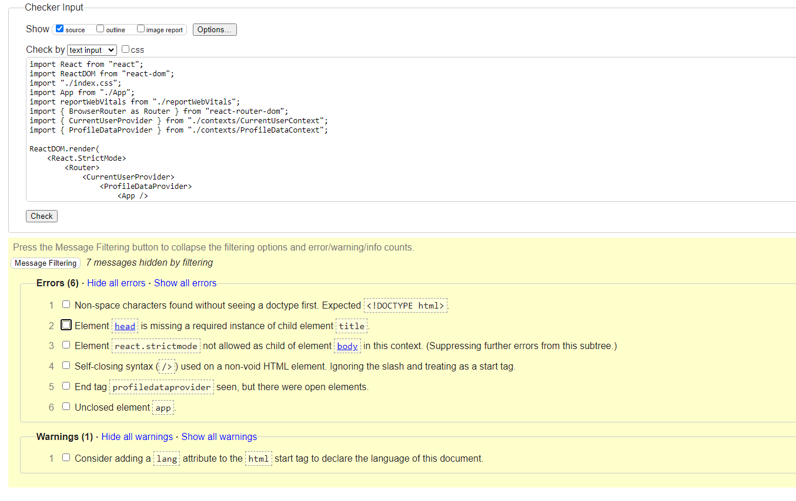
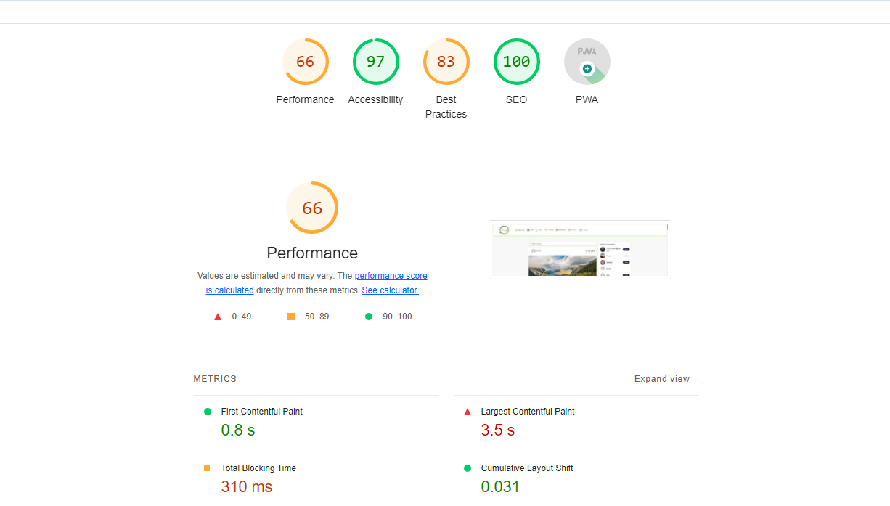
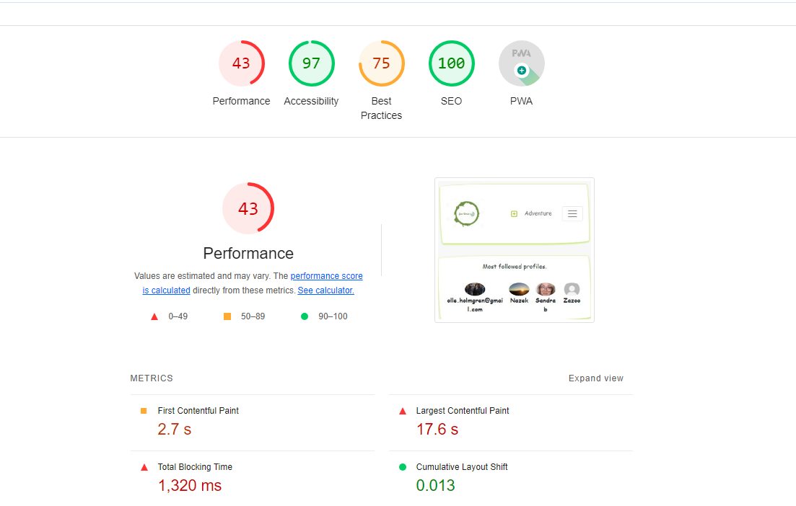

# Manual test guide
This file express code validation, accessibility, performance on various devices, browser compatibility, user stories test

## Table of Content

- [Validation](#validation)
  * [HTML Validation](#html-validation)
  * [CSS Validation](#css-validation)
  * [JSX Validation](#jsx-validation)
- [Accessibility](#accessibility)
- [Performance](#performance)
  * [Performance on Desktop Interface](#performance-on-desktop-interface)
  * [Performance on Mobile Interface](#performance-on-mobile-interface)
- [Performing tests on various devices](#performing-tests-on-various-devices)
- [Browser compability](#browser-compability)
- [Automated testing](#automated-testing)
- [Manual testing](#manual-testing)
  * [Features test](#Features-test)
  * [UX test](#UX-test)
- [Conclusion](#summary)

<small><i><a href='http://ecotrust-canada.github.io/markdown-toc/'>Table of contents generated with markdown-toc</a></i></small>

## Validation

### HTML Validation
[W3C Markup Validation](https://validator.w3.org/) is a service provided by the W3C that  validates the HTML. It checks  syntax , semantics, improper tag usage, and others.
This validating step helps ensuring adhere of the web pages to web standards.

The html passed through the validation. 
<details><summary>Results</summary></details>

| **Tested** | **Result** | **View Result**
--- | --- | --- 
|index| No errors | <details><summary>Screenshot of result</summary></details>

[Back to the top](#table-of-content)

<br>


### CSS Validation
[W3C Jigsaw](https://jigsaw.w3.org/css-validator/) is a tool provided by the World Wide Web Consortium (W3C) that allows you to validate and check the correctness of your CSS code. It helps ensure that your web pages comply with the standards set by the W3C, promoting interoperability and accessibility. I have tested by adding each page to the validator.

| **Tested** | **Result** | **View Result** 
--- | --- | --- 
|Home| No errors|[Result](https://jigsaw.w3.org/css-validator/validator?uri=https%3A%2F%2Fschool-fun-times-1ec741f7cadd.herokuapp.com%2F&profile=css3svg&usermedium=all&warning=1&vextwarning=&lang=en)
|Sign in| No errors|[Result](https://jigsaw.w3.org/css-validator/validator?uri=https%3A%2F%2Fschool-fun-times-1ec741f7cadd.herokuapp.com%2Fsignin&profile=css3svg&usermedium=all&warning=1&vextwarning=&lang=en)
|Sign up| No errors|[Result](https://jigsaw.w3.org/css-validator/validator?uri=https%3A%2F%2Fschool-fun-times-1ec741f7cadd.herokuapp.com%2Fsignup&profile=css3svg&usermedium=all&warning=1&vextwarning=&lang=en)
|Create adventure| No errors|[Result](https://jigsaw.w3.org/css-validator/validator?uri=https%3A%2F%2Fschool-fun-times-1ec741f7cadd.herokuapp.com%2Fposts%2Fcreate&profile=css3svg&usermedium=all&warning=1&vextwarning=&lang=en)
|Update post| No errors|[Result](https://jigsaw.w3.org/css-validator/validator?uri=https%3A%2F%2Fschool-fun-times-1ec741f7cadd.herokuapp.com%2Fposts%2F31&profile=css3svg&usermedium=all&warning=1&vextwarning=&lang=en)
|Bookmark| No errors|[Result](https://jigsaw.w3.org/css-validator/validator?uri=https%3A%2F%2Fschool-fun-times-1ec741f7cadd.herokuapp.com%2Fadventureslist&profile=css3svg&usermedium=all&warning=1&vextwarning=&lang=en)
|Profile| No errors|[Result](https://jigsaw.w3.org/css-validator/validator?uri=https%3A%2F%2Fschool-fun-times-1ec741f7cadd.herokuapp.com%2Fprofiles%2F8&profile=css3svg&usermedium=all&warning=1&vextwarning=&lang=en)
|Edit username| No errors|[Result](https://jigsaw.w3.org/css-validator/validator?uri=https%3A%2F%2Fschool-fun-times-1ec741f7cadd.herokuapp.com%2Fprofiles%2F8%2Fedit%2Fusername&profile=css3svg&usermedium=all&warning=1&vextwarning=&lang=en)
|Edit password| No errors|[Result](https://jigsaw.w3.org/css-validator/validator?uri=https%3A%2F%2Fschool-fun-times-1ec741f7cadd.herokuapp.com%2Fprofiles%2F8%2Fedit%2Fpassword&profile=css3svg&usermedium=all&warning=1&vextwarning=&lang=en)
|Edit profile| No errors|[Result](https://jigsaw.w3.org/css-validator/validator?uri=https%3A%2F%2Fschool-fun-times-1ec741f7cadd.herokuapp.com%2Fprofiles%2F8%2Fedit&profile=css3svg&usermedium=all&warning=1&vextwarning=&lang=en)
|About| No errors|[Result](https://jigsaw.w3.org/css-validator/validator?uri=https%3A%2F%2Fschool-fun-times-1ec741f7cadd.herokuapp.com%2Fabout&profile=css3svg&usermedium=all&warning=1&vextwarning=&lang=en)


Although the validator returned some error messages, these are due to external libraries and frameworks that are known to be reliable and widely used. The custom code written for this project has been thoroughly checked and does not contain any important errors or issues.

[Back to the top](#table-of-content)

<br>

### JSX Validation

ESLint was integrated into the IDE. This integration enables real-time analysis of the code as it's written, providing immediate feedback on potential issues.

For example, ESLint shows the following warning when defining `axiosReq` and `counter` but not using it.

```bash
WARNING in [eslint] 
src/pages/posts/Post.js
  Line 7:20:  'axiosReq' is defined but never used          no-unused-vars
  Line 27:9:  'counter' is assigned a value but never used  no-unused-vars

webpack compiled with 1 warning
```

During the development process, the eslint raise warnings and errors while occurring, it helps to maaintain the code.

```bash
Compiled successfully!

You can now view fun-times in the browser.

  Local:            http://localhost:3000
  On Your Network:  http://172.17.0.2:3000

Note that the development build is not optimized.
To create a production build, use npm run build.

webpack compiled successfully
  ```
**Running 'npx eslint'**
When running npx eslint in the terminal, the linting check is performed on the entire codebase, including files that may not be currently open or actively being edited. This enables the detection of linting errors that may not have been captured by the "regular" ESLint setup during development.

When executing the following command, no errors are displayed in my case, this indicates that npx eslint run successfully as this command will not display any feedback or output incase of no errors.

```bash
npx eslint
```

## Accessibility

[The WAVE Web Accessibility Evaluation Tool](https://wave.webaim.org/) was used to assess the accessibility of the website. WAVE helps identify potential accessibility issues and provides guidance on how to improve the accessibility of web content.

During the evaluation, the following issues were identified:
| **Tested** | **Result** | **View Result**
--- | --- | --- 
|All pages| no Contrast Errors|<details><summary>Screenshot of result</summary></details> 

[Back to the top](#table-of-content)

<br>

## Performance
Fun times website was tested through the Google Lighthouse in Google Chrome Developer Tools.  This tool offers evaluation of Performance, Accessibility, Best Practices, and SEO parameters. The following tests are available for both desktop and mobile.

### Desktop Performance
Results are shown in the following table, the reason behind having the performace 49% is because of the images size.

| **Performance** | **Accessibility* | **Best Practice | **SEO** |**View Result**
--- | --- | --- | --- | --- 
|49/100| 95/100 | 91/100 | 100/100 |<details><summary>Screenshot of result</summary></details>

### Mobile Performance

homepage was evaluated for performance on mobile devices, the same that is mentioned above causes low performance. 
**Performance** | **Accessibility* | **Best Practice | **SEO** |**View Result**
--- | --- | --- | --- | ---
|34/100| 97/100 | 83/100 | 100/100 |<details><summary>Screenshot of result</summary></details>

[Back to the top](#table-of-content)

<br>

## Tests on different mobile devices 
The website was tested on the following devices, and it works fine:
- Samsung Galaxy S21.
- Iphone XR
- Galaxy Fold
- IPad Air

In addition, the website was tested using Google Chrome Developer Tools  for all available device options.

[Back to the top](#table-of-content)

<br>

## Browser compability
The website was tested on the following browsers:
- Google Chrome
- Microsoft Egde

[Back to the top](#table-of-content)

<br>

## Automated testing
[Jest](https://jestjs.io/) is a powerful and flexible testing framework for JavaScript and was used in this project along with (React Testing Library)[https://testing-library.com/docs/react-testing-library/intro/] for the React component tests. These tools provide an excelent way to simulate user behavior and verity that the application is functioning as expected. 


Here is an example of a test performed against the login page.

**Login Page Test:** This test verifies that the username field, password field and the login button are rendered on the login page. 

To run the test suite, use the below command in the terminal:

```bash
npm test
```

The current status of the test is as follows:

```bash

 PASS  src/App.test.js
 PASS  src/pages/auth/_tests_/SigninForm.test.js
A worker process has failed to exit gracefully and has been force exited. This is likely caused by tests leaking due to improper teardown. Try running with --detectOpenHandles to find leaks. Active timers can also cause this, ensure that .unref() was called on them.

Test Suites: 2 passed, 2 total
Tests:       2 passed, 2 total
Snapshots:   0 total
Time:        4.751 s
Ran all test suites related to changed files.

Watch Usage: Press w to show more.

```

[Back to the top](#table-of-content)

<br>

## Manual test

The manual testing has been performed for both the features and the UX,
the first three tables list the manual testing of features  according to Epics.

### Features test
**Epic 1 : General functionalities**
| **User Story** | **Action** | **Expected Result** 
| --- | --- | --- 
| As a first time website visitor I can see one page website, so i can notice all the capabilities at one time. | Click the website link. | Website home page is loaded. 
| As a first time website visitor I can see a friendly UI which comes with a design and colors that children like | View and navigate through three different links | User is able to read all posts and About informations, see the UI design. 
| As a website user (teacher/pupil) I can view a navbar from all pages, so i can navigate easily between pages | Click navabar link. | User is redirected to the desired page. 

**Epic 2 :  Main functionalities**
| **User Story** | **Action** | **Expected Result** 
| --- | --- | --- 
| As a user (teacher/pupil) i can create an account, so i can access all features| Click the sign up icon in the navbar, and enter username and password twice. | User will be redirected to the sign in page. 
| As a registered user, I can login, so i can benefit my access priviliges. | click on Sign in, and enter username and password | User is redirected to the Home page, will all features listed in the Navbar. 
| As a logged in user, I can logout, so I can secure my account. | Click on the Sign out icon in the Navbar. | User is redirected to the Home page. 
| As a logged in user, I can edit my profile, so I can view/update my information. | click on Profile in the Navbar | User is redirected to the Profile page
| As a logged in user, I can write picnics suggestions so other pupils and teachers can consider.| click on Adventure in the Navbar | User is redirected to a page to add the adventure details (image, title, content)
| As a logged in user, I can comment on others posts so i can share my opnion. | click on comment icon | User is redirected to the post page to add the comment.
| As a logged in user, I can like a post to encourage the post owner to participate more. | click on like icon | Counter of likes wil be increased by 1
| As a logged in user, I can follow a pupil or a teacher so i can see their adventures. | click on Follow that is at the 'Most popular profiles' box| All posts of this specific User including the private ones will be visible for you.

**Epic 3 : Customizations**
| **User Story** | **Action** | **Expected Result** 
| --- | --- | --- 
| As a logged in user, i can specify whether the created post is visible only to followers or not, so i can keep it private.| Choose private when create an adventure | Adventure will be visible only for followers. 
| | |


### UX test

In order to have more sets of eyes testing the  project's functionalities, i have asked three colleagues to perform tests and have their impression and remarks.
Below are the test that have been performed by them.

- Register
- Edit and add Profile info.
- Add an adventure, try both private and public visibility.
- Update / delete an adventure.
- Like/bookmark an adventure.
- Comment on an adventure
- Test navigation links.

Each colleague return back with  a feedback, some addressed bugs and errors those which i resolved later. 

[Back to the top](#table-of-content)

<br>

## Summary
Different test have been applied at the application components, all have passed the tests, most of the pages had passed with zero errors.

[Back to the top](#table-of-content)

<br>