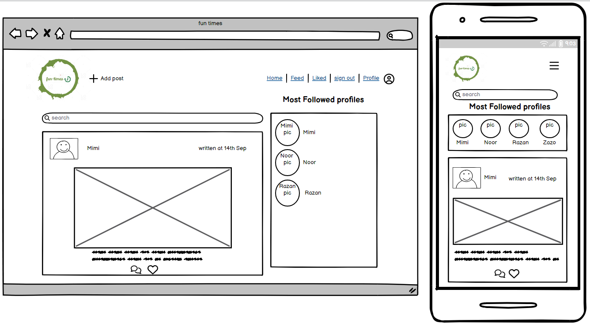
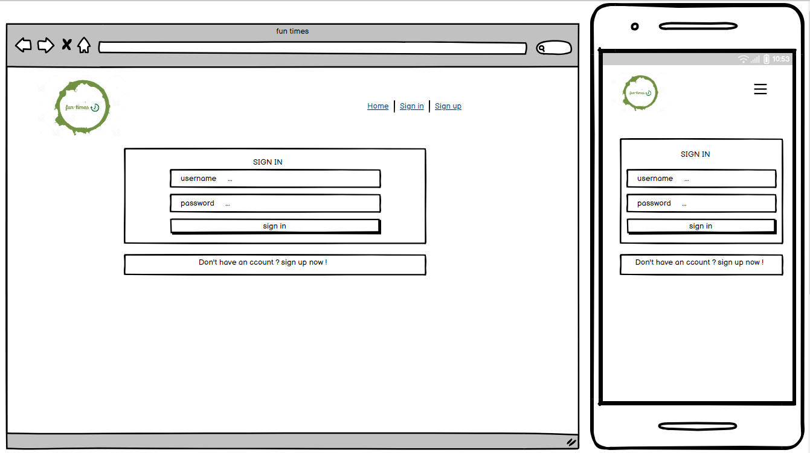
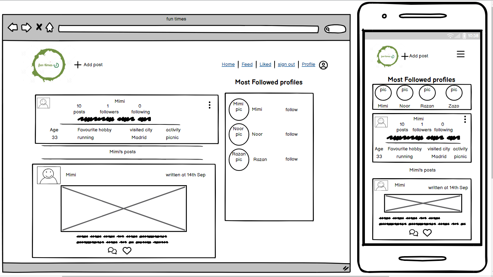
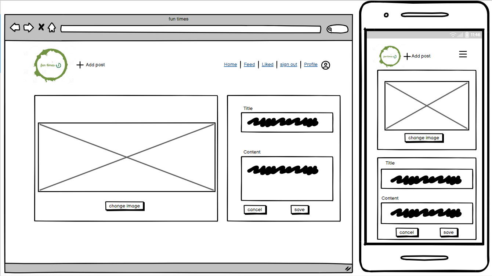
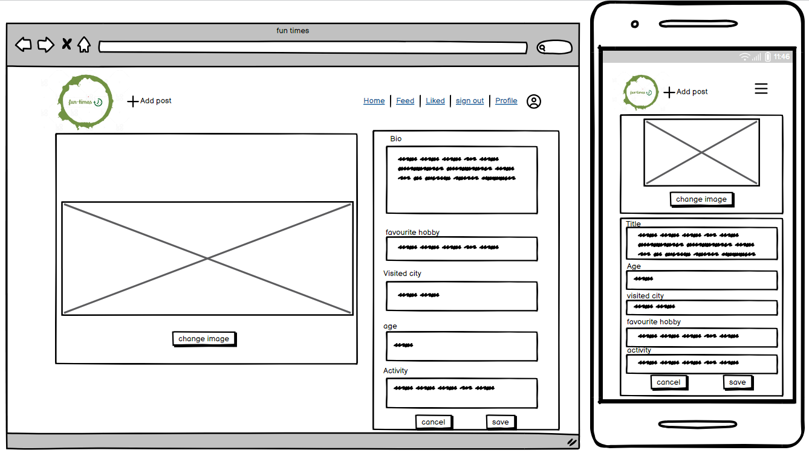
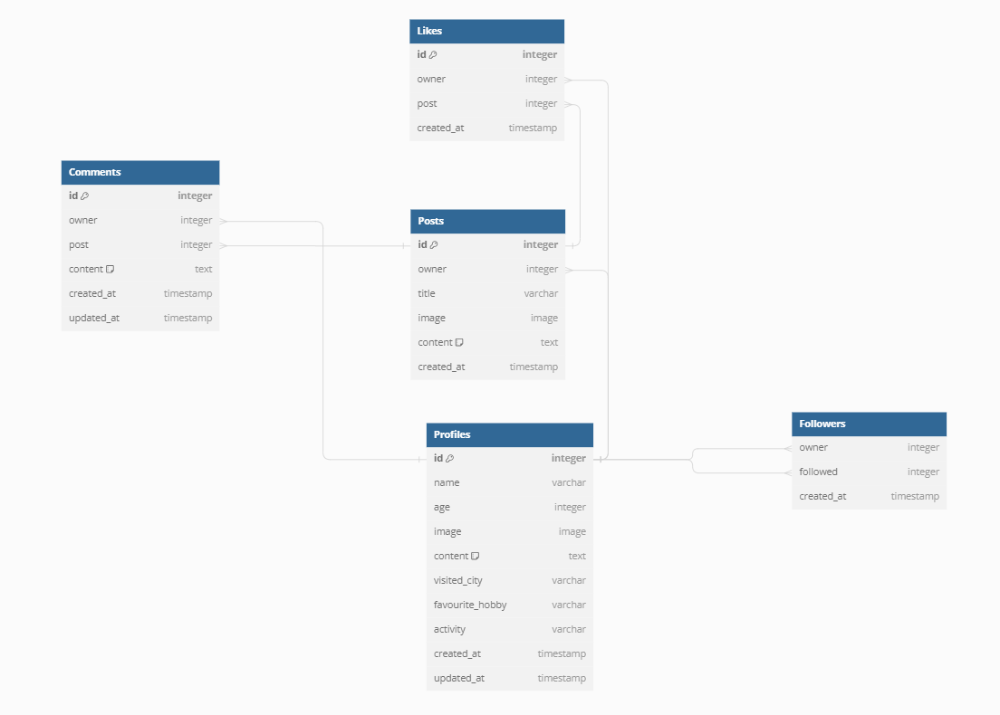

# Goal
Plan and develop school interactive page where pupils and teachers share their individual summer activities. 

# User Experience
I aimed to keep the site attractive for specific age of people that range between primary and secondary school children, accordingly i have chosen the following colours and fonts.

### **Colour Scheme**
I have chosen the green palette colors as follow:
- `#ececa3` : Borders (Header, Footer, Posts).
- `#607c3c` : active icons.
- `#abc32f` : 
- `#b5e550` :
- `#809c13` : 

### **Typography**
I have chosen fonts that are readable and not formal at the same time.
- `Gluten` : the main font.
- `Playfair Display` : used for the written posts and comments. 
- `Font awesome` : used for icons

# User stories
User stories has been divided and done within fixed iterations, each iteration last for 5 days.

### **Epic 1 - General functionalities**
- As a first time website visitor I can see one page website, so i can notice all the capabilities at one time.
- As a first time website visitor I can see a friendly UI which comes with a design and colors that children like.
- As a website user (teacher/pupil) I can view a navbar from all pages, so i can navigate easily between pages, 

### **Epic 2 - Main functionalities**
- As a user (teacher/pupil) i can create an account, so i can access all features.
- As a registered  user, i can login, so i can benefit my access priviliges.
- As a logged in user, I can logout, so I can secure my account.
- As a logged in user, I can edit my profile, so I can view/update my information.
- As a logged in user, I can write picnics suggestions so other pupils and teachers can consider.
- As a logged in user, I can comment on others posts so i can share my opnion. 
- As a logged in user, I can like a post to encourage the post owner to participate more.
- As a logged in user, I can follow a pupil or a teacher so i can see their adventures. 

### **Epic 2 - Customizations**

### **Target Audience**
- Storytellers  who enjoy sharing their fun times experience.
- School pupils who  value being engaged in discussions and interactions.
- Joy seekers who actively seek out new places, experiences, and adventures.

# Features
### **Existing features**
- **Main page**
- **Header**
- **Account management**
- **User profile**
- **Add/Remove Post**
- **Comment/Like**
- **Follow**
- **Footer**
### **Future Features**
- **Website reviews**

# Wireframes
I've used [Balsamiq](https://balsamiq.com/wireframes) to design the website wireframes, 
I've created wireframes for different screen sizes (desktop, mobile).

Home

Sign in

Profile page

Edit post

Edit profile

# System Design
The database consists of four tables, Profiles, Posts, Comments, Likes, Followers.
Here is the Entity relationship diagram 
# Agile development process
The development process went smoothly with the use of the Github roadmap project board.
I named my project in the Github **fun times**.
I created and prioritized  the issues according to `MOSCOW`.
I have followed the iterative approach, each sprint last for 5 days.
- **Sprint 1 (Aug 22nd To 26th, 2023)**
    - [x] [User story: Setup environment](https://github.com/Nazek-Altayeb/fun-times/issues/1) <code style="color:red">(Must have)</code>
    - [x] [User story: Add project Goal and User-Stories to the readme](https://github.com/Nazek-Altayeb/fun-times/issues/2) <code style="color:#5319E7">(Should have)</code>
    - [x] [User story: Add navigation bar](https://github.com/Nazek-Altayeb/fun-times/issues/3) <code style="color:red">(Must have)</code>
- **Sprint 2 (Aug 23rd To 31th, 2023)**
    - [x] [User story: Registration](https://github.com/Nazek-Altayeb/fun-times/issues/4), moved to sprint 3<code style="color:red">(Must have)</code>
    - [x] [User story: Login](https://github.com/Nazek-Altayeb/fun-times/issues/5), moved to sprint 4 <code style="color:red">(Must have)</code>
    - [x] [User story: Logout](https://github.com/Nazek-Altayeb/fun-times/issues/6), moved to sprint 5 <code style="color:red">(Must have)</code>
    - [x] [User story: Profile management](https://github.com/Nazek-Altayeb/fun-times/issues/7), moved to sprint 5 <code style="color:red">(Must have)</code>
    - [x] [Deploy to Heroku](https://github.com/Nazek-Altayeb/fun-times/issues/9)<code style="color:#5319E7">(Should have)</code>
- **Sprint 3 (Sep 1st To 5th, 2023)**
    - [x] [User story: Registration](https://github.com/Nazek-Altayeb/fun-times/issues/4)<code style="color:red">(Must have)</code>
    - [x] Fix issues caused by configuration errors <code style="color:red">(Must have)</code>
- **Sprint 4 (Sep 6th To 10th, 2023)**
    - [x] [User story: Login](https://github.com/Nazek-Altayeb/fun-times/issues/5) <code style="color:red">(Must have)</code>
    - [] [Combine the API and the front-end in the same workspace](https://github.com/Nazek-Altayeb/fun-times/issues/8) <code style="color:#5319E7">(Should have)</code>
- **Sprint 5 (Sep 11th To 15th, 2023)**
    - [x] [User story: Logout](https://github.com/Nazek-Altayeb/fun-times/issues/6) <code style="color:red">(Must have)</code>
    - [] [User story: Profile management](https://github.com/Nazek-Altayeb/fun-times/issues/7) <code style="color:#5319E7">(Should have)</code>
    - [x] [User story: Create post](https://github.com/Nazek-Altayeb/fun-times/issues/10) <code style="color:red">(Must have)</code>

# Bugs
### **Fixed bugs**
- Bug: Route element is not recognized, 
    - fix: down grade the react-router-dom to version 5
- Bug: Navigation breaks
    - uninstall React and React-dom version 18, install version 17 
- Bug: Refresh token is not working properly, means logged in user have to login again after page refresh. 

# Testing 
To Do ......
Here stays a link for the mannual testing, and bugs ...!

# Tools & Technologies
The website has been implemented with the use of a variety of technologies.

- [HTML](https://en.wikipedia.org/wiki/HTML) used for the main site content.
- [CSS](https://en.wikipedia.org/wiki/CSS) used for the main site design and layout.
- [JSX](https://legacy.reactjs.org/docs/introducing-jsx.html) used for user interaction on the site.
- [Python](https://www.python.org) used as the back-end programming language.
- [Git](https://git-scm.com) used for version control.
- [GitHub](https://github.com) used for secure online code storage.
- [CodeAnyWhere](https://codeanywhere.com) used as a cloud-based IDE for development.
- [React Bootstrap](https://react-bootstrap.netlify.app/) used as the front-end CSS framework for modern responsiveness and pre-built components.
- [Django](https://www.djangoproject.com) used as the Python framework for the site.
- [PostgreSQL](https://www.postgresql.org) used as the relational database management.
- [ElephantSQL](https://www.elephantsql.com) used as the Postgres database.
- [Heroku](https://www.heroku.com) used for hosting the deployed back-end site.
- [Django Summernote](https://github.com/summernote/django-summernote) used for the body field for blog posts.
- [DB Diagram](https://dbdiagram.io/d) used for desiging the ER diagram.
- [Balsamiq](https://balsamiq.com/) used for designing the website UI.

# Deployment
To Do ......
Here stays the  (Fork, Clone, Heruko Deployment) paragraphs ........... 

# Credits
### **Content**
To Do ......
### **Media**
To Do ......
### **Aknowledgement**
To Do ......
